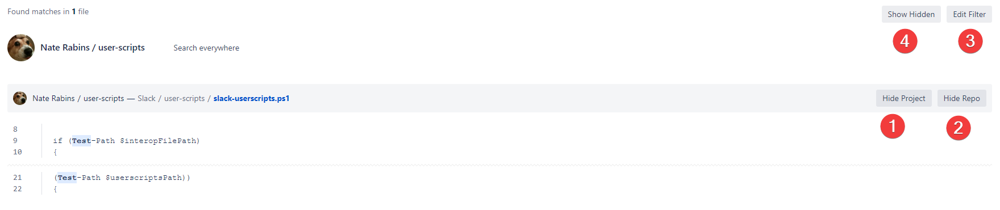

# Problem
Some bitbuckets have a _lot_ of projects and repositories. Sometimes when searching, you'll find that you're swamped with results from projects and repositories that you do not (and probably will never) care about.

According to the documentation, Bitbucket search parsing supports AND, NOT, (), and project and repo modifiers. However, as far as I can tell, there is no way to meaningfully combine these into a query that says 'Hey, Bitbucket, I don't want to see anything from Automation or Design or Tools please.'

# What the script does
This script allows you to specify projects and repositories that you want to hide from your current and future searches.

In action:

## Added features:

### Per result
**Hide Project button** (1) hides the project and any repositories within

**Hide Repo button** (2) hides the repository

### Top level

**Edit Filter** (3) shows the projects and repositories that have been configured to be hidden and allows you to show them again

**Show Hidden button** (4) toggles showing all hidden results

# Setup
1. Install a userscript manager (Tampermonkey/Greasemonkey are popular ones for Chrome/Firefox, respectively).
1. Install this script by copying the contents of `hide-projects-and-repos.user.js` into a new script in the userscript manager.
1. Modify the following line, replacing `<bitbucketdomain>` with your bitbucket's domain:
`// @match        <bitbucketdomain>/plugins/servlet/search?q=*`
1. Save the script.

# Disclaimer
This is by far the largest userscript I have written and it is a bit of a jQuery spaghetti monster, so bugs are expected. If you come across any, please make an issue in this repository and I'll get to it when I can. Thank you!